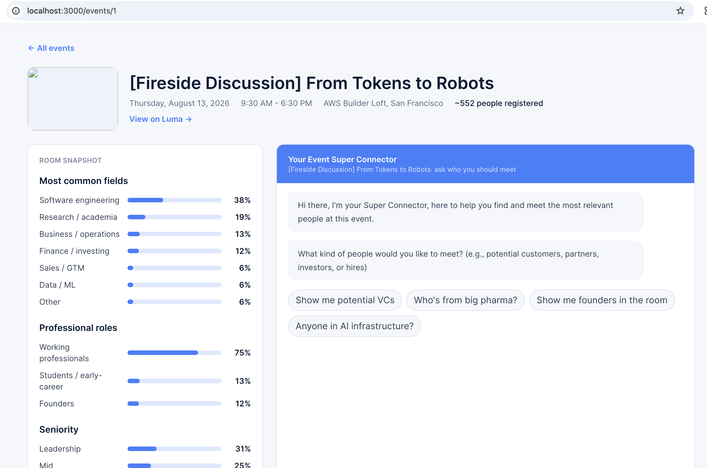

<p align="center">
  
</p>

# Luma Connects

Luma Connects is an event intelligence tool: paste a Luma event link and it
uses Bright Data to research the event and the public web, classifies who's
likely to be in the room, and lets you ask a chat assistant natural-language
questions ("show me potential VCs") to get back LinkedIn-linked person cards.
It combines Bright Data Web Unlocker and SERP API with a Python OpenAI Agents
SDK workflow, a FastAPI service, and a Next.js frontend
(`invite_viewer/`) -- see [`docs/RUNBOOK.md`](docs/RUNBOOK.md) for how to run
the full app.

Under the hood, the discovery agent:

1. Fetches a public event page, such as `https://luma.com/vla-night-panel`, through Bright Data Web Unlocker.
2. Uses Bright Data SERP API to search Google for public LinkedIn profile URLs in a target city.
3. Optionally fetches public profile pages through Web Unlocker for more evidence.
4. Returns a structured shortlist of people who may be relevant for the event.

Bright Data does not have a product named "Locker" in the current docs. This project uses **Web Unlocker / Unlocker API**, plus **SERP API**.

## Screenshot



## Web app

The full product is two services that run together: a FastAPI backend
(`src/invite_finder/`) and a Next.js frontend (`invite_viewer/`). Paste a
Luma event link into the frontend, and it drives the backend to fetch the
event, classify who's likely attending, and answer chat questions about them.

### Backend

```bash
python3 -m venv .venv
source .venv/bin/activate
pip install -e ".[dev]"
cp .env.example .env
```

Fill in `.env`:

- `OPENAI_API_KEY`
- `BRIGHTDATA_API_KEY`
- `BRIGHTDATA_SERP_ZONE`
- `BRIGHTDATA_UNLOCKER_ZONE`

The Bright Data REST APIs use `Authorization: Bearer <api key>` and the shared request endpoint `https://api.brightdata.com/request`. SERP requests send a Google search URL through a SERP zone; Web Unlocker requests send the target event or profile URL through a Web Unlocker zone.

Then start the API:

```bash
set -a && source .env && set +a
.venv/bin/uvicorn invite_finder.api.app:app --port 8000
```

No Bright Data or OpenAI credentials yet? Run it offline instead — see
[`docs/RUNBOOK.md`](docs/RUNBOOK.md#running-locally) for cache-seeded demo
mode that costs nothing.

### Frontend

```bash
cd invite_viewer
npm install
cp .env.local.example .env.local   # points at http://localhost:8000 by default
npm run dev
```

Open [http://localhost:3000/events](http://localhost:3000/events), paste a
Luma event link, and open the event once analysis finishes.

Full setup, environment variable reference, testing, and Fly.io deployment
instructions are in [`docs/RUNBOOK.md`](docs/RUNBOOK.md).

## Command-line tool

The `invite-finder` CLI drives the same public-web discovery agent
standalone, writing a JSON report instead of talking to the API/frontend:

```bash
invite-finder \
  --event-url "https://luma.com/vla-night-panel" \
  --city "San Francisco" \
  --max-profiles 20 \
  --max-serp-queries 12 \
  --serp-results-per-query 20 \
  --max-page-fetches 10 \
  --max-agent-turns 35 \
  --output reports/vla-night-panel-sf.json
```

For a larger pull, increase the search budget as well as `--max-profiles`:

```bash
invite-finder \
  --event-url "https://luma.com/vla-night-panel" \
  --city "San Francisco Bay Area" \
  --max-profiles 200 \
  --max-serp-queries 24 \
  --serp-results-per-query 40 \
  --max-page-fetches 25 \
  --max-agent-turns 70 \
  --output reports/vla-night-panel-bay-area-200.json
```

You can also run it without installing the console script:

```bash
python -m invite_finder.cli \
  --event-url "https://luma.com/vla-night-panel" \
  --city "San Francisco"
```

## Notes

- The workflow only targets public web pages and public search results.
- It does not log in to LinkedIn, manage accounts, bypass user consent flows, or send outreach.
- Treat the output as a research shortlist. Review every candidate before using the data for outreach.
- Increase `--max-serp-queries` and `--max-page-fetches` carefully because those settings drive Bright Data usage.
- If you increase those budgets, also increase `--max-agent-turns`; the OpenAI Agents SDK defaults to 10 loop turns, and each search/fetch can require another turn.
- `--max-profiles` is an output target, not magic inventory. For large pulls, use higher `--max-serp-queries` and `--serp-results-per-query` so the agent has enough public search results to choose from.

## References

- OpenAI Agents SDK: `https://developers.openai.com/api/docs/guides/agents/quickstart`
- OpenAI Agents SDK tools: `https://developers.openai.com/api/docs/guides/tools#usage-in-the-agents-sdk`
- Bright Data SERP API: `https://docs.brightdata.com/api-reference/rest-api/serp/serp-api`
- Bright Data Unlocker API: `https://docs.brightdata.com/api-reference/rest-api/unlocker/unlock-website`
